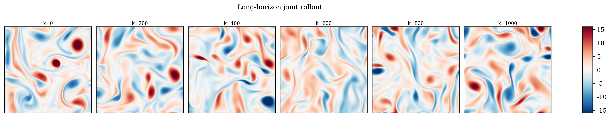
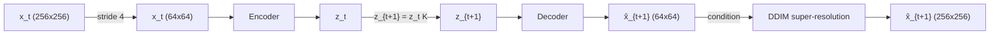
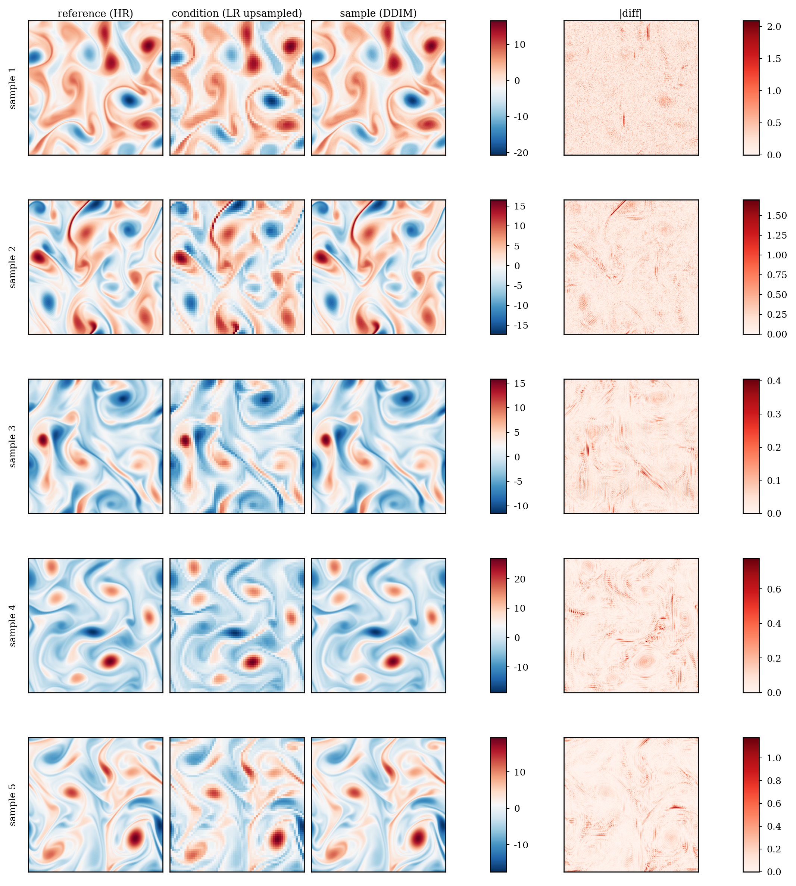
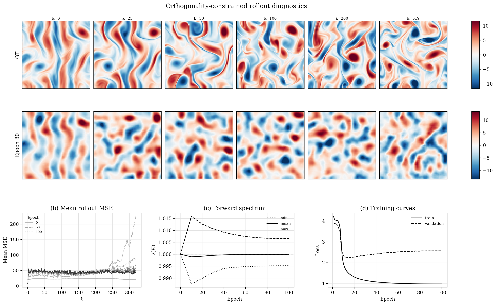
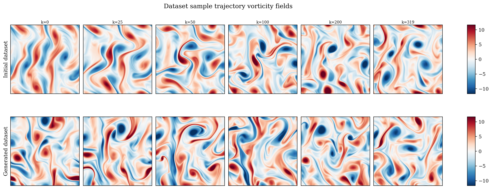
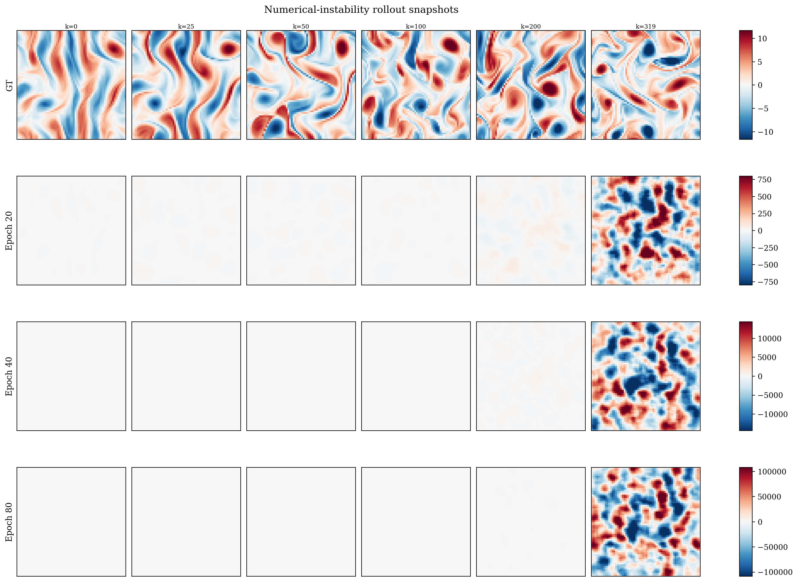
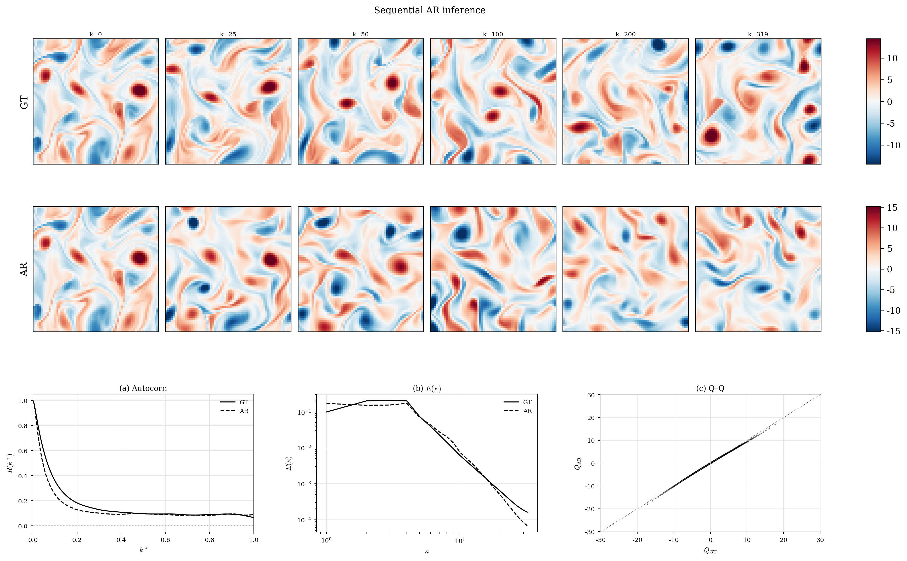
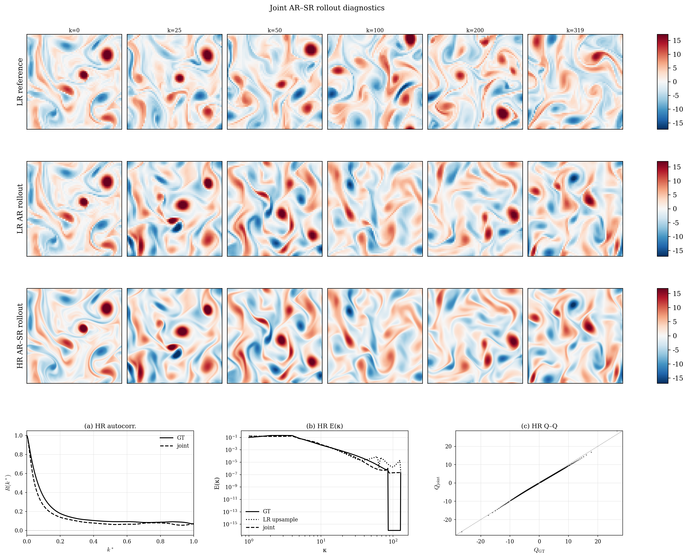
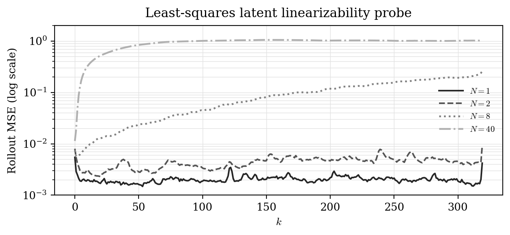
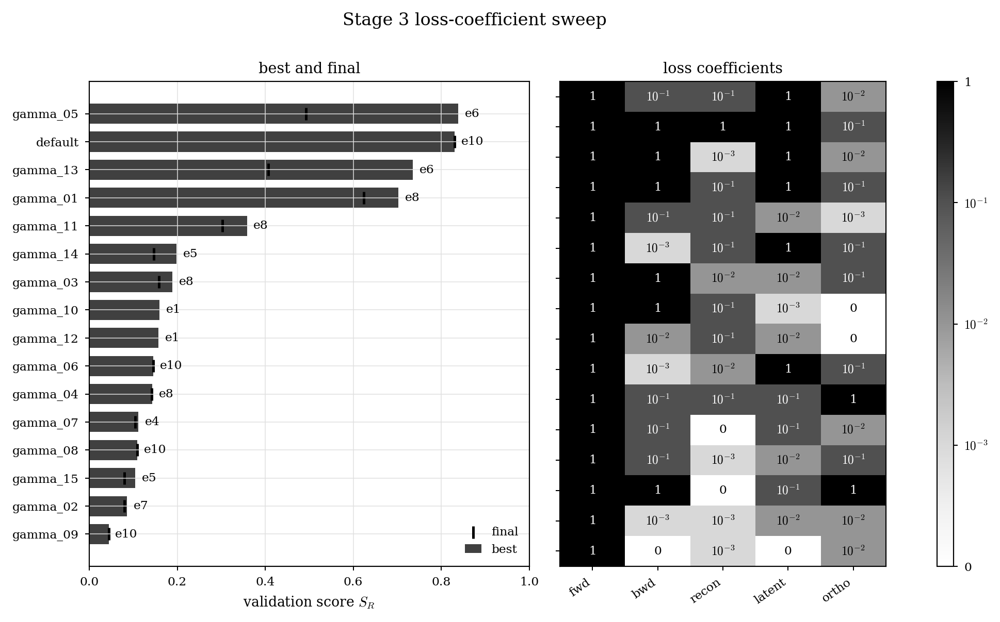

# x01: From $x_0$ to $x_1$

Learning 2D Kolmogorov flow with a Koopman autoencoder for time and a
conditional diffusion model for space.

This is the code for my MSc Machine Learning thesis at UCL, supervised by Dr.
Xiao Xue, Dr. Ira Shokar and Prof. Peter V. Coveney. The full thesis is in
[`docs/x01-thesis.pdf`](docs/x01-thesis.pdf).

> **Please also cite Uni-Flow.** The AR-SR framework in this repository builds
> directly on [Uni-Flow](https://arxiv.org/abs/2602.15592) (Xue et al., 2026).
> If you use this code, cite Uni-Flow alongside this thesis. See
> [Citation](#citation).

For full logs regarding development see [`Logs.md`](/Logs.md).

For generated/used dataset see
[Google Drive](https://drive.google.com/drive/folders/1vMOehVMPw78rg4vREeKe6RSuaUrESRnQ?usp=share_link).



## Idea

Predicting turbulent vorticity at high resolution is expensive, so the problem
is split in two:



- **AR module (time).** A Restormer-style transformer autoencoder maps each
  64x64 frame to a finite latent where a single learned square matrix `K`, the
  Koopman operator, advances the state linearly. It is trained with forward,
  backward, reconstruction, consistency, orthogonality and latent-rollout
  losses.
- **SR module (space).** An SR3-style conditional UNet, trained as a DDPM and
  sampled with DDIM, reconstructs 256x256 frames from the upsampled
  low-resolution prediction.
- **Joint module.** Chains the two to produce high-resolution rollouts beyond
  the data horizon.

## Conclusion 

- **Dataset.** I generated a new Re=1000 dataset of 314 post-transient
  trajectories (320 frames at 256x256) with a pseudo-spectral solver. It
  replaced a 40-trajectory set dominated by transients.
- **SR works.** Diffusion SR recovers coherent small-scale structure and the
  energy spectrum from clean 64x64 conditions.
- **AR is the bottleneck.** Strict single-`K` rollouts are fragile. They are
  sensitive to capacity, loss weighting, checkpoint choice and inference mode.
  Orthogonality regularisation keeps the spectrum near the unit circle and stops
  blow-ups, but it does not fix long-horizon drift.
- **Sequential inference** (re-encoding every step) gave the most useful
  rollouts, and the full AR-SR pipeline runs end-to-end.
- **Linearisability probe.** A single `K` fitted by least squares on frozen
  autoencoder latents tracks 1-2 trajectories well. Its rollout error grows
  quickly as more trajectories are added (N = 8, 40). This points at the
  finite-Koopman assumption itself, not only at optimisation.

| SR reconstruction                                                                          | Orthogonality-constrained AR                                                                                |
| ------------------------------------------------------------------------------------------ | ----------------------------------------------------------------------------------------------------------- |
|  |  |

<details>
<summary>More figures</summary>

|                                                                                                                                                  |                                                                                                                                |
| ------------------------------------------------------------------------------------------------------------------------------------------------ | ------------------------------------------------------------------------------------------------------------------------------ |
|  Initial vs generated dataset                                 |  Numerical blow-up of an unconstrained `K` |
|  Sequential AR inference on the test set |  Joint AR-SR diagnostics        |
|  Least-squares linearisability probe              |  Loss-coefficient sweep |

</details>

## Repository layout

```
run_sim.py        pseudo-spectral Kolmogorov flow solver -> .npy dataset
train_ar.py       train the Koopman autoencoder (DDP, torch.compile, W&B)
train_sr.py       train the conditional diffusion SR model
run_joint.py      AR rollout -> SR upsampling from saved checkpoints
conf/             Hydra configs, override any key with key=value
src/x01/
  sim/            KMFlowSolver (CN-Heun, dealiasing, forcing, drag)
  data/           trajectory-split dataset, pair and frame loaders
  ar/             Koopman AE, dynamics blocks, losses (Lp, Sobolev Hs, MSE), diagnostics
  sr/             UNet, DDPM loss, DDIM sampler
experiments/thesis_plots/
                  one folder per thesis figure: produce_*.py (GPU) and plot_*.py
tests/            unit tests for every module
docs/             thesis PDF
```

## Quickstart

Requires [uv](https://docs.astral.sh/uv/) and Python 3.11. On Linux, the
lockfile resolves to CUDA 12.6 wheels. On macOS, it resolves to CPU wheels.

```bash
uv sync
uv run pytest
uv run ruff format . && uv run ruff check .
```

Download the datasets from
[Google Drive](https://drive.google.com/drive/folders/1vMOehVMPw78rg4vREeKe6RSuaUrESRnQ?usp=share_link)
and put them next to the repo, in its parent directory. `run_sim.py` also writes there.

```
kmflow_re1000_r256_b400_f320_clean.npy   # main dataset, (314, 320, 256, 256)
kmflow_highres.npy                       # initial 40-trajectory dataset
kmflow_10unique.npy, kmflow_50unique.npy # subsets for the linearisability probe
```

To check the whole pipeline end to end without the dataset, run the smoke
chain. It takes a few minutes on a laptop CPU. Each step feeds the next
through `../kmflow_smoke.npy` and `checkpoints/smoke/`:

```bash
uv run python run_sim.py smoke=true
uv run python train_ar.py training.smoke=true
uv run python train_sr.py training.smoke=true
uv run python run_joint.py smoke=true
```

Full runs:

```bash
uv run python train_ar.py                # AR stage
uv run python train_sr.py                # SR stage
uv run python run_joint.py \
    checkpoints.ar_path=<ar.pt> checkpoints.sr_path=<sr.pt>
```

W&B logging is off by default. Enable it with `wandb.enabled=true`.

Each figure folder has a `produce_*.py` that writes an `.npz` from the dataset
and checkpoints, and a `plot_*.py` that renders it. The `.npz` plot data ships
with the repo, so figures 03-11 can be redrawn straight away:

```bash
for f in experiments/thesis_plots/*/plot_*.py; do uv run python "$f"; done
```

Figures 01-02 plot the datasets directly. `joint_pipeline_stage_c_full.npz`
keeps only the 6 frames the figure shows. Rerun `produce_joint_pipeline_data.py`
for the full 1024-frame rollout.

## License

The code is released under the [MIT License](LICENSE). The thesis in the
[`docs/x01-thesis.pdf`](docs/x01-thesis.pdf) is not covered by it. It may be
copied and distributed freely, as long as the source material is acknowledged.

## Citation

This work builds on Uni-Flow, which introduced the unified autoregressive
(time) plus diffusion super-resolution (space) formulation used here. If you
use this code, please cite both works:

```bibtex
@article{xue2026uniflow,
  title   = {{Uni-Flow}: A Unified Autoregressive-Diffusion Model for Complex
             Multiscale Flows},
  author  = {Xue, Xiao and Yang, Tianyue and Gao, Mingyang and Pan, Leyu and
             Wang, Maida and Zhu, Kewei and Wang, Shuo and Li, Jiuling and
             ten Eikelder, Marco F. P. and Coveney, Peter V.},
  journal = {arXiv preprint arXiv:2602.15592},
  year    = {2026},
  url     = {https://arxiv.org/abs/2602.15592}
}


@mastersthesis{sahin2026x01,
  title  = {X01: From $x_0$ to $x_1$. On Learning Flow Dynamics in Two-Dimensional Kolmogorov Flow
            using Koopman Operator Theory and Diffusion-Based Vorticity Reconstruction},
  author = {\c{S}ahin, Efe},
  school = {University College London},
  year   = {2026},
  note   = {Supervised by Dr. Xiao Xue, Dr. Ira Shokar and Prof. Peter V. Coveney}
}
```
